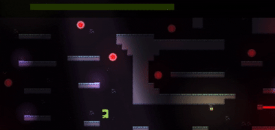
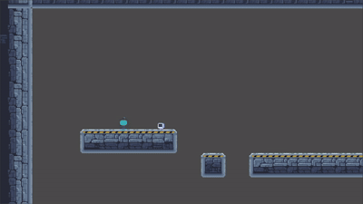
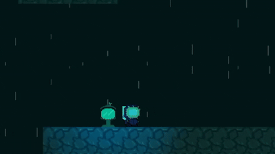
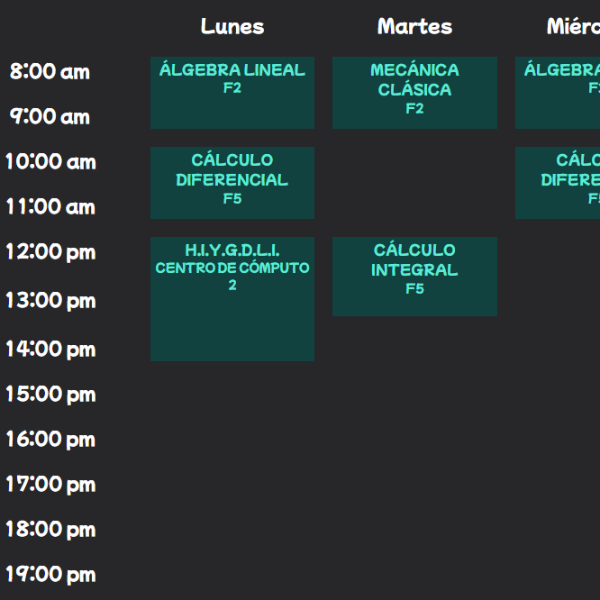
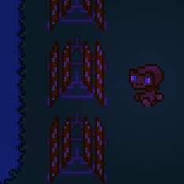
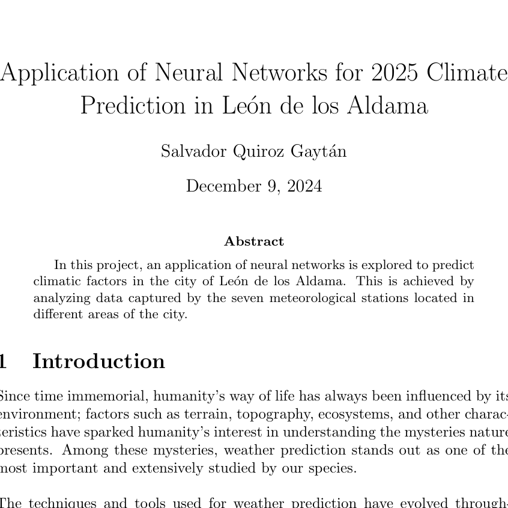

<div align="center">

[comment]: <> (View Counter)
<br><table width="100%" cellspacing="0" cellpadding="0" border="0" style="border-collapse: collapse;">

  <tr>
    <td width="43%" rowspan="2" style="padding:0; margin:0; height:100%;">
      
    </td>
    <td width="18%" style="padding:0; margin:0;">
      
    </td>
  </tr>
  <tr>
    <td width="18%" style="padding:0; margin:0;">
      
    </td>
  </tr>
</table>

<div>
  
  <div align=center>
      <a href="https://git.io/typing-svg"></a>
  </div>
</div>

<br>

<div align=center>
  <a href="https://www.linkedin.com/in/salvadorquiroz/"></a>
  <a href="mailto:quirozsalvador1b@gmail.com?subject=Hi%20Chava%20,%20nice%20to%20meet%20you!"></a>
  <a href="https://salvadorquiroz.com/"></a>  
  
  <a href="https://play.google.com/store/apps/details?id=com.prometeo.tes&hl=es_MX"></a>
  <a href="https://lichess.org/@/Chavaquiroz"></a>

</div>

<h3 align="left" style="color:#18A34A;">🐉 About me </h3>

[//]: # (You must have a lf before the markdown element when inside a block for it to work: https://stackoverflow.com/questions/29368902/how-can-i-wrap-my-markdown-in-an-html-div)

<div align="left">

```java
/**
 * Represents me.
 *
 * @param city            León, Guanajuato, Mexico.
 * @param languages       Spanish, English.
 * @param jobTitle        Software Developer and Physics Engineer.
 * @param experience      3+ years
 * @param specialization  Optimization, machine learning & software development.
 * @param interests       Operations Research, optimization, machine learning & quantum computing.
 * @param hobbies         Chess, videogame programming & teaching.
 * @param education       BSc Physics Engineering, University of Guanajuato.
 * @param approachable    Yes, for research, videogames development, software or exciting projects.
 * @param strength        Responsible.
 * @param weakness        Perfectionism.
 * @param birthday        25th of September (a good christmas).
 * @throws Punch          To any and all bugs.
 * @return                Salvador.
 */
```
</div>


<h3 align="left" style="color:#18A34A;">📗 Technologies</h3>
<table width="100%" cellspacing="10" cellpadding="0" border="0">
<tr>
<td width="25%" align="center" valign="top" style="border:1px solid #D1D5DB; border-radius:8px; padding:12px;">
<strong style="color:#18A34A;">Programming Languages</strong>
<br><br>


</td>
<td width="25%" align="center" valign="top" style="border:1px solid #D1D5DB; border-radius:8px; padding:12px;">
<strong style="color:#18A34A;">Back-end</strong>
<br><br>


</td>
<td width="25%" align="center" valign="top" style="border:1px solid #D1D5DB; border-radius:8px; padding:12px;">
<strong style="color:#18A34A;">Mobile</strong>
<br><br>


</td>
<td width="25%" align="center" valign="top" style="border:1px solid #D1D5DB; border-radius:8px; padding:12px;">
<strong style="color:#18A34A;">Front-end</strong>
<br><br>


</td>
</tr>
<tr>
<td width="25%" align="center" valign="top" style="border:1px solid #D1D5DB; border-radius:8px; padding:12px;">
<strong style="color:#18A34A;">Database</strong>
<br><br>


</td>
<td width="25%" align="center" valign="top" style="border:1px solid #D1D5DB; border-radius:8px; padding:12px;">
<strong style="color:#18A34A;">Data Science &amp; AI</strong>
<br><br>


</td>
<td width="25%" align="center" valign="top" style="border:1px solid #D1D5DB; border-radius:8px; padding:12px;">
<strong style="color:#18A34A;">System, Networking &amp; Deployment</strong>
<br><br>


</td>
<td width="25%" align="center" valign="top" style="border:1px solid #D1D5DB; border-radius:8px; padding:12px;">
<strong style="color:#18A34A;">Terminal Scripts</strong>
<br><br>


</td>
</tr>
<tr>
<td width="25%" align="center" valign="top" style="border:1px solid #D1D5DB; border-radius:8px; padding:12px;">
<strong style="color:#18A34A;">Tools</strong>
<br><br>


</td>
<td width="25%" align="center" valign="top" style="border:1px solid #D1D5DB; border-radius:8px; padding:12px;">
<strong style="color:#18A34A;">Game Development</strong>
<br><br>


</td>
<td width="25%"></td>
<td width="25%"></td>
</tr>
</table>

<h3 align="left" style="color:#18A34A;">🚃 Recent Projects</h3>

<table width="80%" cellspacing="12" cellpadding="0" border="0">
  <tr>
    <td width="33%" valign="top"
        style="border:1px solid #D1D5DB; border-radius:8px; padding:10px;">
      
      <h4>Wigo (In Progress...)</h4>
      <p>
        Software Developer for Wigo, a ride-hailing platform for iOS and Android that connects users with drivers and provides on-demand transportation services.
      </p>
    </td>
    <td width="33%" valign="top"
        style="border:1px solid #D1D5DB; border-radius:8px; padding:10px;">
      
      <h4>Horarios Guapos / USchedU <br> (In Progress...)</h4>
      <p>
        A university scheduling application that uses optimization techniques to generate efficient class schedules based on availability and scheduling constraints.
      </p>
    </td>
    <td width="33%" valign="top"
        style="border:1px solid #D1D5DB; border-radius:8px; padding:10px;">
      
      <h4>ET REMAKE (In Progress...)</h4>
      <p>
        A remake project focused on recreating and modernizing the original Atari ET  , with a focus on improving gameplay, systems, and overall performance.
      </p>
    </td>
  </tr>
  <tr>
  <td width="33%" valign="top"
        style="border:1px solid #D1D5DB; border-radius:8px; padding:10px;">
      
      <h4>PROMETEO</h4>
      <p>
        PROMETEO is a self-developed educational space-themed mobile game designed to inspire young people to explore space and STEM.
      </p>
    </td>
    <td width="33%" valign="top"
        style="border:1px solid #D1D5DB; border-radius:8px; padding:10px;">
      
      <h4>Neural Networks for Weather Forecasting</h4>
      <p>
        Neural network model for weather forecasting using TensorFlow and historical climatological data from Mexico’s National Meteorological Service (SMN/CONAGUA), with data preprocessing, analysis, and time-series forecasting.
      </p>
    </td>
    <td width="33%" valign="top"
        style="border:1px solid #D1D5DB; border-radius:8px; padding:10px;">
      <h4>And more...</h4>
    </td>
  </tr>
</table>


<h3 align="left" style="color:#18A34A;">🍃Quote </h3>
  <div align="left">One of my favourite quotes is from a song by one of my favourite singers: WOS.</div>
  
  <blockquote>
  
    “Time no longer adds or takes away 
    It only orchestrates its masterpiece
    Each of us plays our part in this stage
    I doubt that life was ever truly ours
    It doesn’t bother me; it even brings relief
    To know I don’t know if I’ll ever be myself
    In this city, songs and deliriums resound
    Tears and revelry rise from a sky of rubble”
  </blockquote>

  <strong>WOS in "MORFEO" (2023)</strong>


<h3 align="left" style="color:#18A34A;">🏕️ Communities</h3>

<table width="100%" cellspacing="10" cellpadding="0" border="0">
  <tr>
    <td width="25%" align="center" valign="top">
      
      <br>
      <strong>Algorithmics</strong>
      <br>
      <small>Programming Instructor</small>
    </td>
    <td width="25%" align="center" valign="top">
      
      <br>
      <strong>Semillas del Futuro</strong>
      <br>
      <small>International Student Success Coordinator</small>
    </td>
    <td width="25%" align="center" valign="top">
      
      <br>
      <strong>AFIF</strong>
      <br>
      <small>General Coordinator</small>
    </td>
    <td width="25%" align="center" valign="top">
      
      <br>
      <strong>EducationUSA</strong>
      <br>
      <small>Opportunity Funds Scholar</small>
    </td>
  </tr>
</table>
<br>

<br>
<br>
<div align="center" style="color: #888; font-size: 13px; padding: 20px 0;"> © 2026 Salvador Quiroz Gaytán :) · All rights reserved. 🦖</div>
</div>
